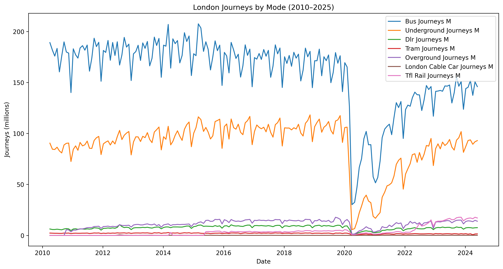
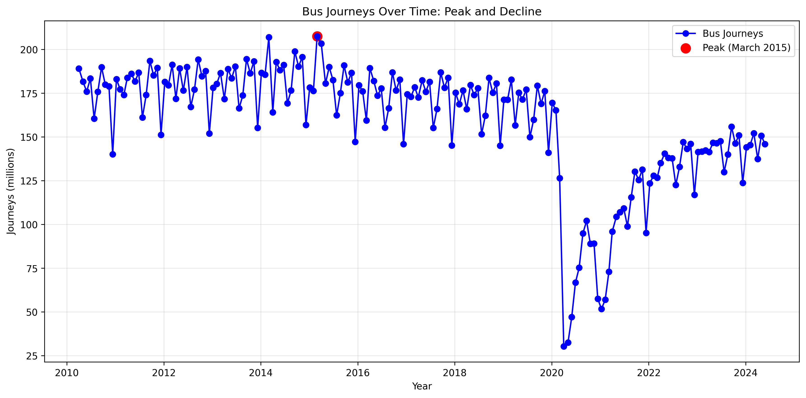
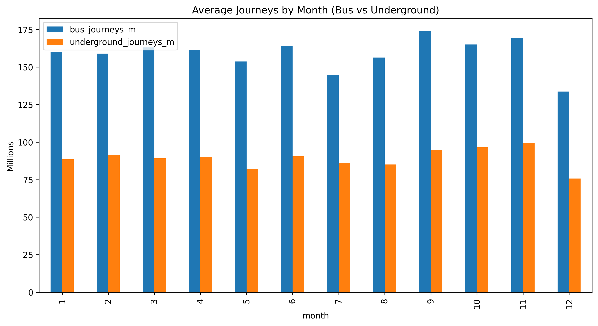
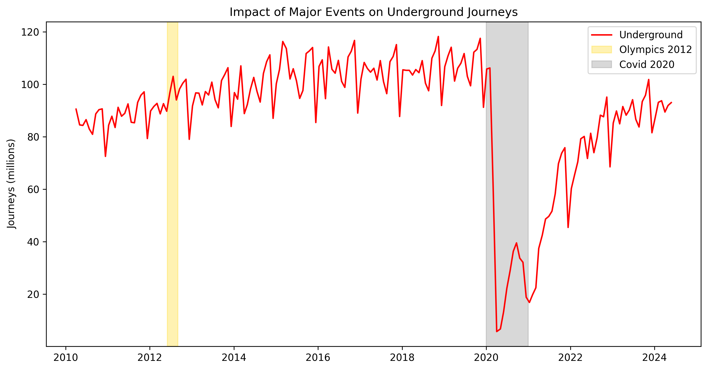

# London Mobility

## Motivation
As someone who has lived in London all my life, public transport is central to how I move around the city. This project grew out of my curiosity about how Londoners move around, how travel patterns change over time, and what drives these changes, especially during major events like the Olympics or disruptions like COVID-19.

## Goal
By analysing TfL journey data, I wanted to explore trends in transport usage across the city, understand which modes dominate daily travel, and see how events and seasonal changes affect Londoners' mobility.

## Dataset
- **TfL Journeys by Mode** (`tfl-journeys-type.csv`)  
  Contains monthly journey counts (in millions) across different transport modes, including bus, Underground, DLR, tram, Overground, cable car, and TfL Rail.  
  Coverage: 2011-2025.  

## Features
- Analysis of journey volumes across transport modes  
- Identification of long-term trends, seasonal variation, and the impact of major events  
- Visualisation of mobility patterns over time  

## Tools & Technologies
- Python (pandas, matplotlib)  
- Google Colab  
- Git & GitHub for version control  

## Data Cleaning Summary
The dataset was cleaned and prepared for analysis in Python using pandas. The following steps were carried out:
1. **Converted date columns** (`period_beginning`, `period_ending`) to datetime format.  
2. **Renamed and standardised column names** for consistency and easier use in Python.  
3. **Handled missing values** in journey counts by filling them with `0`.  
4. **Removed duplicates** to prevent double-counting.  
5. **Verified column data types** for consistency.  
6. **Exported the cleaned dataset** (`tfl-journeys-type-cleaned.csv`) for reproducible analysis.  

---

## Analysis & Findings

### 1. Trends Across All Modes
  
Most modes follow steady patterns, but all show a sharp dip in 2020 due to COVID-19. Bus and Underground dominate overall, while the Cable Car remains minimal and highly seasonal.

### 2. Bus Peak
Bus journeys reached their peak in March 2015 at 207.5 million journeys, almost double Underground usage at the same time. March peaks also appear in 2014, likely linked to TfL’s reporting cycles and seasonal travel patterns (spring commuting, school terms, better weather). 

### 3. Bus Journeys Over Time
  
After 2015, bus usage shows a steady decline, reflecting service cuts, congestion, and competition from rail and cycling. The long-term view highlights how bus journeys never returned to their mid-2010s highs.  

### 4. Bus vs Underground
  
When compared directly, buses consistently carried more passengers than the Underground until the mid-2010s. Both modes fell sharply in 2020, but bus journeys recovered faster, suggesting they remained essential for everyday trips.

### 5. Seasonality

Journeys follow a seasonal rhythm: dips in summer (holidays) and December (Christmas), with peaks in spring and autumn. Recognising these patterns helps with planning services and managing demand.

### 6. Event Impact

Big events shape travel in London. The 2012 Olympics temporarily boosted Underground journeys, while COVID-19 led to an unprecedented collapse across all modes.

---

## Conclusion 
London's transport system is highly dynamic, shaped by seasonality and global events. Buses and the Underground form the backbone of mobility, but they respond differently to disruption, with buses proving more resilient after COVID-19.

This project showed me how numbers reflect real-life experiences, such as the near-desertion of central London during the pandemic.

Working through this project gave me a deeper understanding of London's mobility patterns. It also helped me understand the entire data analysis workflow, from cleaning messy data and exploring trends to choosing the right visualisations and communicating insights from data.

---

## Next Steps
Future work could include interactive visualisations using tools like Plotly, allowing us to zoom in and explore trends in detail. It could also incorporate additional data sources, such as datasets on Underground lines and qualitative information like passenger satisfaction, to identify which lines are most used or preferred. Additionally, adding a machine learning component, such as an LSTM time series model, to predict future transport trends and better understand how patterns might evolve.
 
