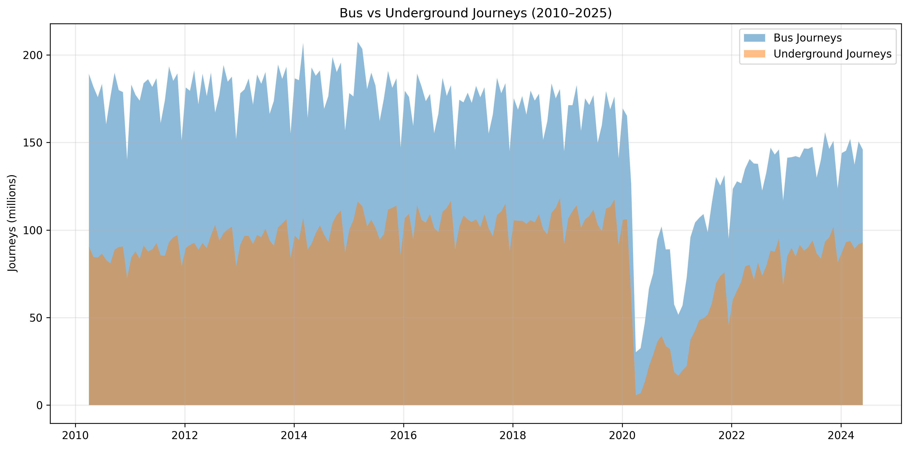
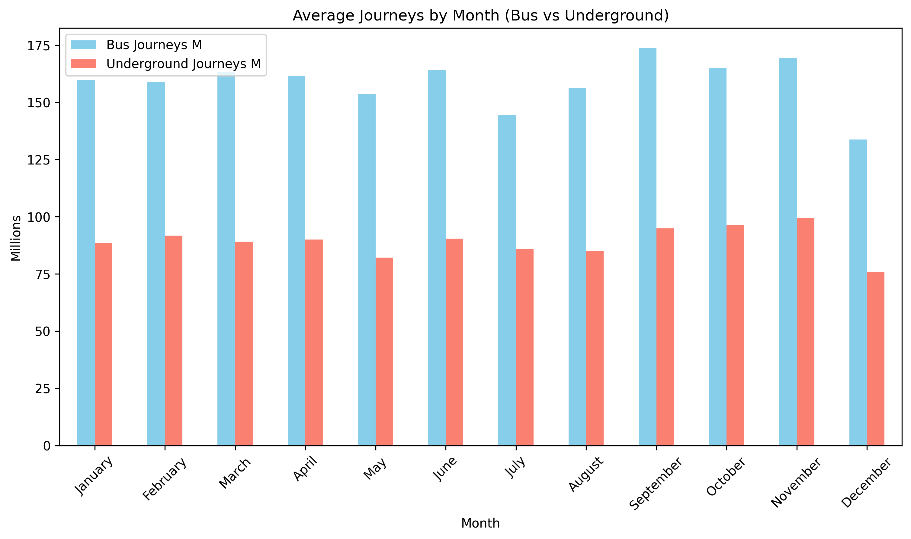

# London Mobility

## Motivation
As someone who has lived in London all my life, public transport is central to how I move around the city. This project grew out of my curiosity about how Londoners move around and how travel patterns change over time, especially during major events like the Olympics or disruptions like COVID-19. 

## Goal
By analysing TFL journey data, I wanted to explore trends in transport usage across the city, understand which modes dominate daily travel, and see how events and seasonal changes affect Londoner's mobility.

## Dataset
- **TfL Journeys by Mode** (`tfl-journeys-type.csv`)  
  Contains monthly journey counts (in millions) across different transport modes, including bus, Underground, DLR, tram, Overground, cable car, and TfL Rail.  
  Coverage: 2011 - 2025.  

## Features
- Analysis of journey volumes across transport modes  
- Identification of long-term trends, seasonal variation, and the impact of major events  
- Visualisation of mobility patterns over time  

## Tools & Technologies
- Python (pandas, matplotlib)  
- Google Colab  
- Git & GitHub for version control  

## Data Cleaning Summary
Data cleaning was carried out in Python using pandas to prepare the dataset for analysis.  
The following steps were applied:  
1. **Converted date columns** (`period_beginning`, `period_ending`) to datetime format.  
2. **Renamed columns** to snake_case for easier use in Python.  
3. **Handled missing values** in journey counts by filling them with `0`.  
4. **Removed duplicates** to prevent double-counting.  
5. **Verified column data types** for consistency.  
6. **Exported a cleaned dataset** (`tfl-journeys-type-cleaned.csv`) for reproducible analysis.  

---

## Analysis & Findings

### 1. Trends Across All Modes
  
Bus and Underground dominate journeys across London. The sharp decline in 2020 reflects the COVID-19 lockdowns, showing how global events can drastically change daily life.

### 2. Bus vs Underground
  
Both modes declined significantly in 2020, but bus journeys recovered more quickly than the Underground, suggesting greater resilience.  

### 3. Seasonality
  
Journeys consistently dip in August (holiday period) and December (Christmas), with peaks in spring and autumn months.  

### 4. Event Impact
  
The 2012 Olympics boosted Underground journeys temporarily, while COVID-19 caused an unprecedented collapse in 2020.  

---

## Conclusion 
London's transport system is highly dynamic, shaped by seasonality and global events. Buses and the Underground form the backbone of mobility, but they respond differently to disruption, with buses proving more resilient after COVID-19.

This project showed me how numbers reflect real-life experiences, such as the near-desertion of central London during the pandemic.

Working through this project gave me a deeper understanding of London's mobility patterns while also helping me understand the entire data analysis workflow, from cleaning messy data and exploring trends to choosing the right visualisations and telling a story with numbers.

---
 
